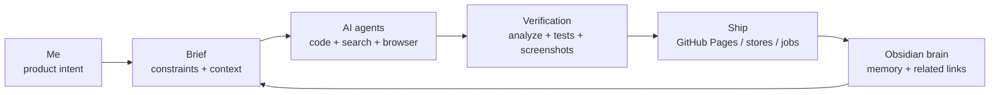

  

  
  
  

## Jo Donggeon / CDGDG

I build product systems with AI agents in the loop.

Flutter is still one of my tools, but it is no longer the whole story. My current work is closer to **agentic product engineering**: connecting app screens, APIs, data contracts, automation scripts, browser verification, deployment, and an Obsidian-backed knowledge graph into one working feedback loop.

### Current Signal

| Area | What I Actually Build |
| --- | --- |
| AI agent workflow | Codex / Claude Code harnesses, task memory, Obsidian brain, verification loops |
| Product engineering | Mobile apps, web surfaces, admin tools, API flows, release operations |
| Automation | Content pipelines, browser QA, app-store release support, scheduled jobs |
| Public proof | [Portfolio](https://cdgdg.github.io), [Brain graph](https://cdgdg.github.io/#/brain), shipped app projects |

### AI Ops Telemetry

  

Live card served by `api/ai-usage.svg.js`. A Codex automation refreshes aggregate Codex telemetry every day at 03:00 KST and redeploys the Vercel endpoint. No prompts, file contents, or secrets are published.

### Operating Loop

### Working Stack

  
  
  
  
  
  
  
  
  
  
  
  

### Featured Work

| Project | Focus |
| --- | --- |
| [CDGDG Portfolio](https://cdgdg.github.io) | Flutter web portfolio, project detail pages, GitHub Pages deployment, public positioning |
| [Brain](https://cdgdg.github.io/#/brain) | Split graph between my knowledge and AI work logs, with related-node matching |
| FinalSay | Debate/content automation, seed generation, upload workflows, operational recovery |
| Mobile app projects | Flutter apps, API integration, Firebase, GraphQL, store release and maintenance |

### Code Sample

[Flutter / Bloc / Riverpod sample](https://github.com/CDGDG/cdgdg_flutter_code)

  

