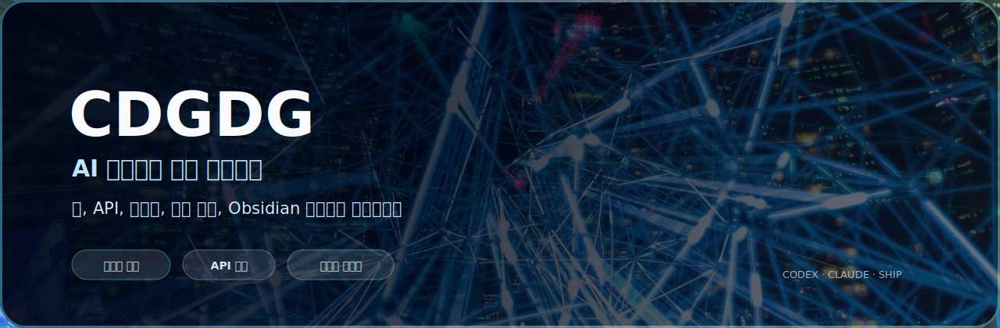

  

  
  
  

## 조동건 / CDGDG

요즘은 AI 에이전트와 같이 제품을 만듭니다.

한동안은 저를 Flutter 개발자로 설명하는 게 제일 쉬웠습니다. 지금도 Flutter는 좋아하고 자주 쓰지만, 요즘 더 재미있는 건 화면 하나를 잘 만드는 것보다 그 앞뒤의 흐름까지 이어 붙이는 일입니다. 앱, API, 자동화, 검증, 배포, 작업 기록이 따로 놀지 않게 만들고 있습니다.

### 현재 방향

| 요즘 붙잡는 것 | 하는 일 |
| --- | --- |
| AI 에이전트 | Codex / Claude Code로 반복 작업을 맡기고, 결과를 다시 검증하는 흐름 만들기 |
| 제품 개발 | 모바일 앱, 웹 화면, 관리자 도구, API 연동, 릴리스 운영 |
| 자동화 | 콘텐츠 생성, 브라우저 QA, 앱스토어 배포 보조, 예약 작업 |
| 공개 작업 | [포트폴리오](https://cdgdg.github.io), [브레인 그래프](https://cdgdg.github.io/#/brain), 실제로 배포한 앱들 |

### AI 에이전트 사용량

  

### 사용 스택

  
  
  
  
  
  
  
  
  
  
  
  

### 대표 작업

| 프로젝트 | 초점 |
| --- | --- |
| [CDGDG 포트폴리오](https://cdgdg.github.io) | Flutter web 포트폴리오, 프로젝트 상세 화면, GitHub Pages 배포, 공개 포지셔닝 |
| [브레인](https://cdgdg.github.io/#/brain) | 내 지식과 AI 작업 로그를 분리한 그래프, related 노드 매칭 |
| FinalSay | 토론/콘텐츠 자동화, seed 생성, 업로드 워크플로우, 운영 복구 |
| 모바일 앱 프로젝트 | Flutter 앱, API 연동, Firebase, GraphQL, 스토어 릴리스와 유지보수 |

  

